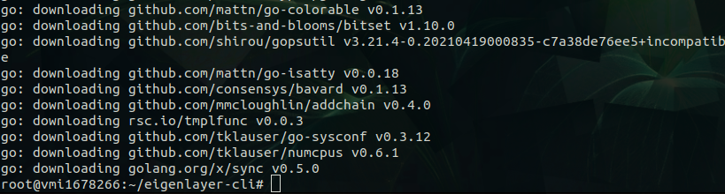

# Przewodnik Uruchomienia Operatora EigenLayer na Testnecie Holesky

Przewodnik ten krok po kroku przeprowadzi Cię przez proces stania się operatorem na testnecie Holesky dla EigenLayer.

## Oficjalna Dokumentacja

Możesz zapoznać się z oficjalną dokumentacją dostępną na [docs.eigenlayer.xyz/operator-guides/operator-installation/](https://docs.eigenlayer.xyz/operator-guides/operator-installation/).

## To jakieś czary?

Te instrukcje wymagają pewien poziom umiejętności obsługi komputera za pomocą terminala/wiersza poleceń. Jeśli wydaje się to dla Ciebie zbyt skomplikowane, mogę zająć się tym procesem za Ciebie. Oczywiście w zamian za wirtualne szekle - 95 USDT/C, a w cenie:

- postawienie serwera - potrzeba udostępnienia wirtualnej karty płatniczej, z małym limitem transakcyjnym, na pokrycie kosztów serwera. (Mogę też przeprowadzić przez proces zakładania serwera na Contabo, kosztuje to dodatkowe 15 usdc) 
- konfiguracja serwera - potrzebne dane do logowania ssh (w przypadku pominięcia pierwszego punktu)
- instalacja i rejestracja operatora - potrzebne dane do uzupełniania pliku `metadata.json`

Jeśli jesteś zainteresowany/a zrobieniem tego za Ciebie to zapraszam do kontaktu: 
- telegram: **@misiurr**
  
# INSTRUKCJE

## Wymagania Wstępne

### Konfiguracja Serwera

1. Potrzebujemy serwera z linuxem aby uruchomić operatora. VPS od [Contabo](https://contabo.com/en/vps/) będzie odpowiedni.
   - Mój wybór to **CLOUD VPS 2** z **400 GB/SDD** dla Storage Type oraz **Ubuntu 20.04 z DOCKER** jako Image. *Dla samego operatora powinna wystarczyć niższa specyfikacja niż VPS, ale ja używam VPS 2, ponieważ planuję późniejsze uruchomienie [AVS](https://github.com/Layr-Labs/eigenda-operator-setup/blob/master/holesky/README.md)*

### Przygotowanie Serwera

1. Oczekuj na e-mail z danymi do logowania do VPS.

2. Po zalogowaniu wykonaj aktualizację VPS:

```bash
sudo apt-get update && sudo apt-get upgrade -y
```

3. Zainstaluj Docker-Compose:

```bash
sudo curl -L "https://github.com/docker/compose/releases/latest/download/docker-compose-$(uname -s)-$(uname -m)" -o /usr/local/bin/docker-compose
sudo chmod +x /usr/local/bin/docker-compose

docker-compose --version
```
   


5. Zainstaluj GO:

   - Pobierz:

```bash
wget https://golang.org/dl/go1.22.1.linux-amd64.tar.gz
```

   - Rozpakuj:

```bash
tar -C /usr/local -xzf go1.22.1.linux-amd64.tar.gz
```

   - Dodaj do środowiska:

```bash
export PATH=$PATH:/usr/local/go/bin
```

   - Sprawdź wersję:

```bash
go version
```
   

## Instalacja EigenLayer CLI

1. Klonuj repozytorium i zbuduj projekt:

```bash
git clone https://github.com/Layr-Labs/eigenlayer-cli.git
cd eigenlayer-cli
mkdir -p build
go build -o build/eigenlayer cmd/eigenlayer/main.go
```
   


2. Skopiuj plik do systemu:

```bash
cp ./build/eigenlayer /usr/local/bin/
```

   - Sprawdź, czy komenda `eigenlayer` działa:

```bash
eigenlayer
```
   
   
## Generowanie Kluczy

1. Generuj klucze prywatne ECDSA i BLS za pomocą CLI. Zapisz je w bezpiecznym miejscu. `<YOUR_NAME>` zastąp wybraną nazwą.

```bash
eigenlayer operator keys create --key-type ecdsa <YOUR_NAME>
```


```bash
eigenlayer operator keys create --key-type bls <YOUR_NAME>
```
   

   - Aby sprawdzić klucze publiczne:

```bash
eigenlayer operator keys list
```

## Konfiguracja Plików

1. Wygeneruj i edytuj pliki konfiguracyjne:
```bash
eigenlayer operator config create
```

   - Jeśli wybierzesz opcję `yes`, Eigen zapyta o kilka danych do wstępnej konfiguracji.

2. Opublikuj plik `metadata.json`, aby zapewnić jego dostęp dla EigenLayer. Możesz wykorzystać GitHub - utwórz nowe repozytorium (koniecznie publiczne) i stwórz w nim plik `metadata.json`. Są też inne opcje dohostingu jak np. Pastebin. Poniższy schemat uzupełniij swoimi danymi:

   ```json
   {
     "name": "<OPERATOR_NAME>",
     "website": "<WEBSITE>",
     "description": "<DESCRIPTION>",
     "logo": "<LOGO_URL>",
     "twitter": "<TWITTER_HANDLE>"
   }
   ```

3. Edytuj plik `operator.yaml`, wklejając RAW URL do Twojego pliku `metadata.json` i uzupełniając pozostałe dane:

```bash
nano operator.yaml
```


   ```yaml
   operator:
     address: <YOUR_ADDRESS>
     earnings_receiver_address: <YOUR_ADDRESS>
     delegation_approver_address: "0x0000000000000000000000000000000000000000"
     staker_opt_out_window_blocks: 0
     metadata_url: <YOUR_METADATA_URL>
     el_delegation_manager_address: 0xA44151489861Fe9e3055d95adC98FbD462B948e7
     eth_rpc_url: https://ethereum-holesky-rpc.publicnode.com/
     private_key_store_path: /root/.eigenlayer/operator_keys/<WALLET_NAME>.ecdsa.key.json
     signer_type: local_keystore
     chain_id: 17000
   ```
   
po edycji naciskamy CRTL+X, następnie Y, a na koniec ENTER

## Rejestracja Operatora

1. Przed rejestracją, przelej co najmniej 1 Holesky ETH na "adress" z operator.yaml. Możesz je zdobyć na - [Holešky PoW Faucet](https://holesky-faucet.pk910.de/).

3. Zarejestruj operatora:

```bash
eigenlayer operator register operator.yaml
```

3. Sprawdź status:

```bash
eigenlayer operator status operator.yaml
```

   

   Status można również sprawdzić na stronie [Holesky EigenLayer Operator](https://holesky.eigenlayer.xyz/operator). *(może potrwać parę minut, zanim pojawi się na stronie)*

